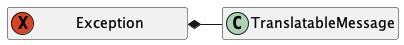
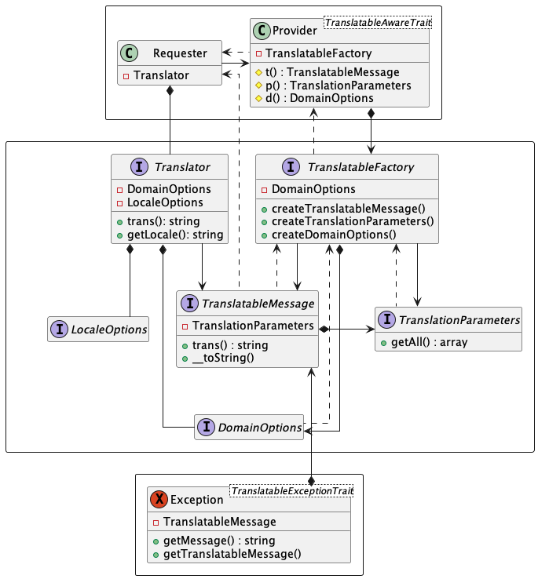
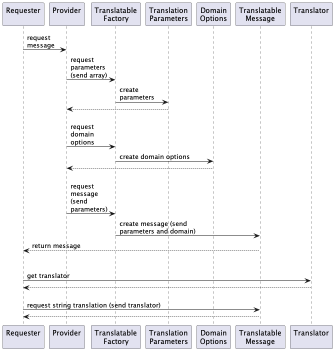

# Translation system

The translation system provides UI string translation for Internationalization (i18n) and Localization (l10n) functionality in client applications. Any string that is intended to be used or viewed by end users is considered a UI string, including exception messages when possible.

## Overview

At the highest level, the translation system is fairly straightforward. A requesting object asks for a translatable message from itself or another object, which returns it. The requesting object sends the message a translator, which it uses to provide a translated primitive string.

 

 

Exceptions hold translatable messages and provide access to them or, in case of failure, their untranslated string forms.

 

## Detail

Here is a view of the complete system machinery:

 

 

Here is the exact sequence of interactions:

 

