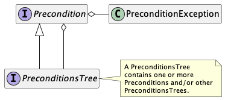
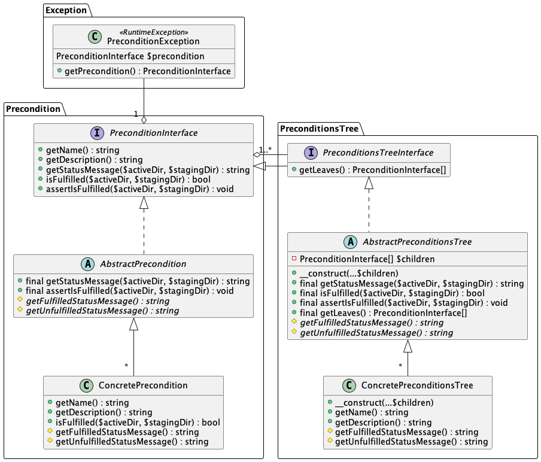
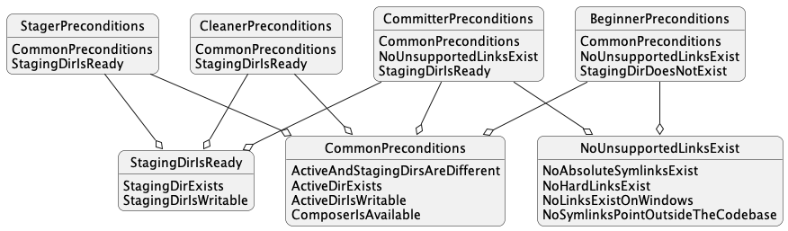

# Precondition system

The precondition system defines and inspects the conditions necessary to perform core domain operations, i.e., begin, stage, commit, and clean. In short, it provides mechanisms for capturing individual preconditions with verification logic, optionally collecting them into groups, and determining their status.

The class design contains three main concepts: 1) A precondition defines one atomic boolean condition, e.g., directory exists or application is available, and the ability to test for its fulfillment. 2) A precondition aggregate collects one or more individual preconditions, implementing (a superset of) the same interface, so they can be treated as a single, compound precondition. In other words, it implements [the decorator design pattern](https://sourcemaking.com/design_patterns/decorator). Preconditions and aggregates can be mixed and nested indefinitely. 3) An exception that can be thrown in case of an unfulfilled precondition..

This diagram depicts the detailed interfaces and relationships. New concrete preconditions should inherit their corresponding abstract classes, which handle precondition-nonspecific features like recursion and exception-handling. 

Below is a depiction of the actual hierarchy of preconditions at the time of this writing. In short, all domain operations have the same preconditions except the beginner, which has a different relationship with the staging directory.

